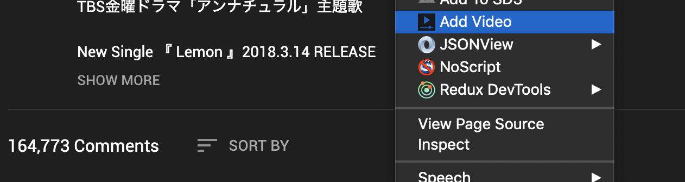
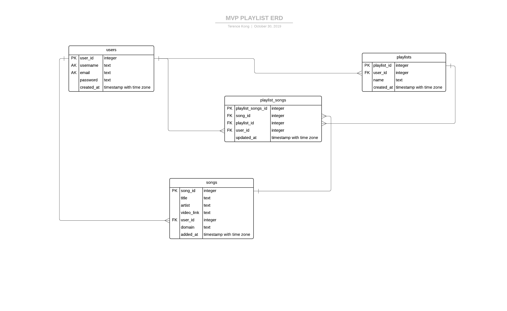
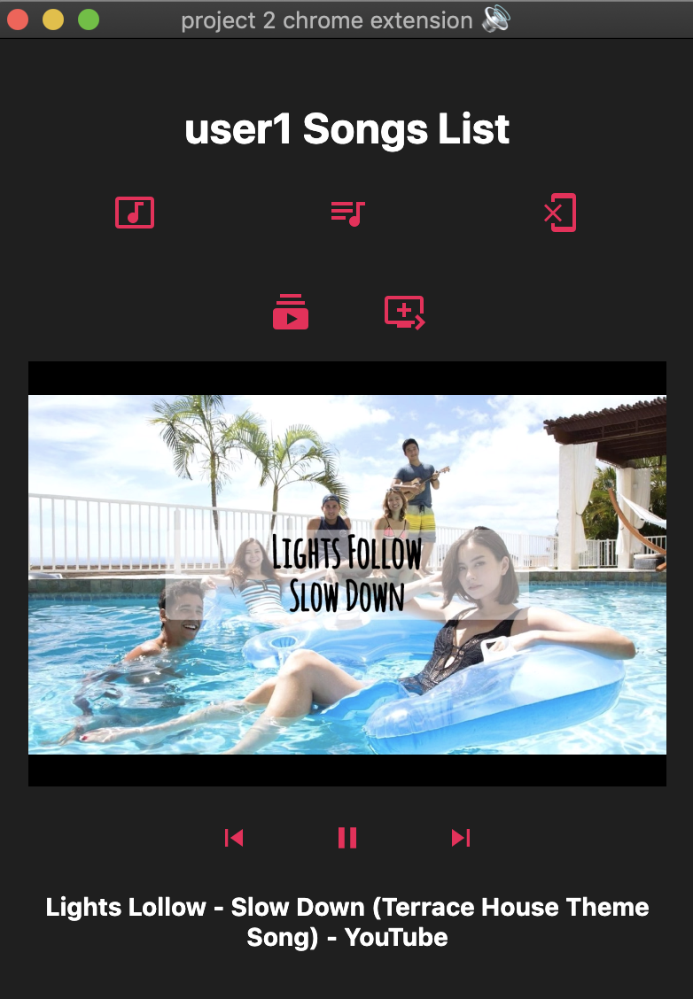
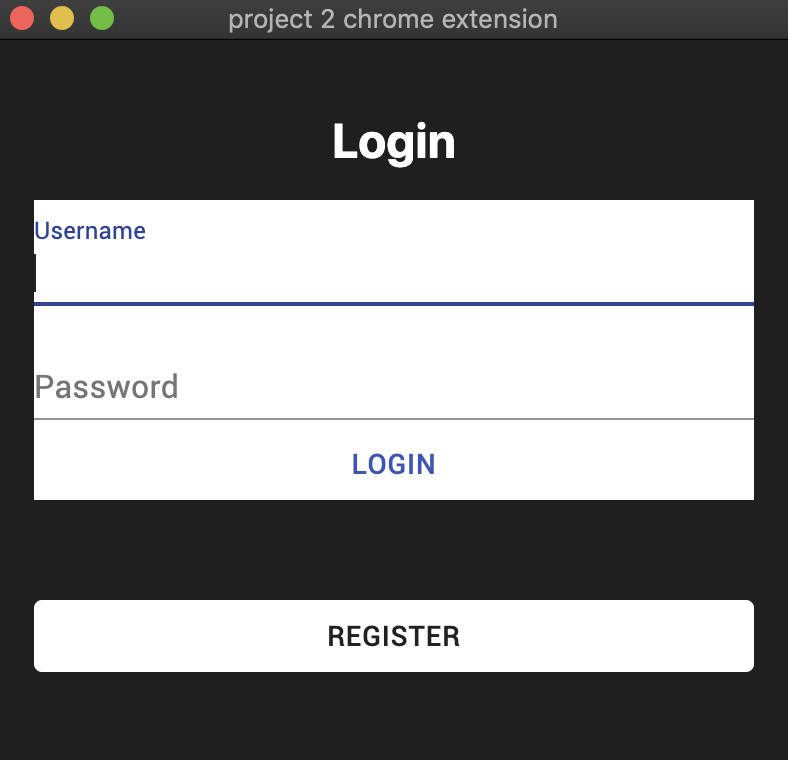

# MVP PLAYLIST (Music Video Player Playlist)
## Objective
1. To play music or videos in the chrome extension
2. Allow saving of personalized settings and playlists
3. Play saved playlist or songs on any computer (as long as the chrome extension is installed)

## Technologies used
* Frontend: React, Redux, Material-ui, Chrome API, Youtube API
* Backend: NodeJS, Express, PostgreSQL

## How to use
### Option 1
  * Clone file
  ```
  git clone https://github.com/reshinto/mvp_playlist.git
  ```
  * Do a npm install
  ```
  cd mvp_playlist
  npm install
  ```
  * Build file
  ```
  npm run build
  ```
  * Add build folder to your chrome extension, at your browser URL type the following
  ```
  chrome://extensions/
  ```
  * Run as developer mode then click on the load unpacked button and upload the build folder where the manifest.json is located
  * This will install this chrome extension to your chrome browser
  * Once installed, you can use it straight away as it has already been configured to connect to the live backend server
### Option 2
  * Go to Chrome Web Store and download (currently in test mode, so no one can download it at the moment)
    * link at the bottom

## Special feature
* Right click anywhere on a website that is not on the video, and click Add Video to auto add video to app


## Chrome Web Store
* https://chrome.google.com/webstore/detail/mvpplaylist/ahlbpejoldepcdidbijooihlmkgokoil

## Backend server link
* https://github.com/reshinto/mvp_playlist_server
* ERD

* Please note that the live backend server is runned on Heroku
  * Therefore, if it is in sleep mode, it might take a while for it to respond initially before waking up.

## Sample Images



## Credits
* Used hk-skit's chrome-extension-starter-kit for basic starter boilerplate template.
  * https://github.com/hk-skit/chrome-extension-starter-kit
